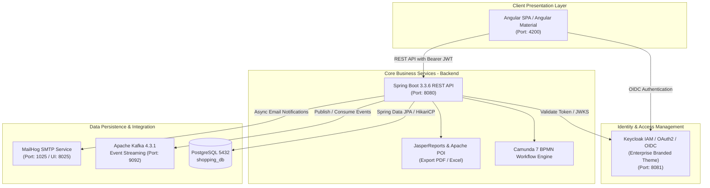

# Enterprise Procurement Management System (EPMS)

[](https://openjdk.org/)
[](https://spring.io/projects/spring-boot)
[](https://angular.dev/)
[](https://www.keycloak.org/)
[](https://camunda.com/)
[](https://kafka.apache.org/)
[](https://www.postgresql.org/)

---

## 1. Executive Overview

**Enterprise Procurement Management System (EPMS)** is an enterprise-grade platform designed to digitize, standardize, and automate corporate procurement workflows, budget validation, and Supplier Relationship Management (SRM).

The system enforces a dual-authorization **Maker - Checker** governance model powered by the **Camunda BPMN** workflow engine, centralized **Keycloak Single Sign-On (SSO)** authentication, and real-time asynchronous event streaming via **Apache Kafka**.

### Core Business Value:
- **Cost Transparency & Control:** Prevents budget overruns through automated pre-approval budget validations (Budget Check).
- **Governance & Regulatory Compliance:** Enforces segregation of duties between procurement initiators (Makers) and approval authorities (Checkers) with full audit trails.
- **Comprehensive Supplier Management:** Streamlines vendor onboarding, capability scoring, legal document compliance, and proposal reviews.
- **Enterprise-Grade Reporting:** Generates high-fidelity PDF procurement vouchers and Excel analytical reports for internal accounting and audit compliance.

---

## 2. System Architecture & Tech Stack

The platform is designed around a modern layered, event-driven micro-service architecture:



### Technology Matrix:

| Component | Core Technology | Role & Highlights |
| :--- | :--- | :--- |
| **Frontend** | Angular 22, TypeScript, SCSS | Single Page Application with Angular Material, Chart.js, OAuth2-OIDC |
| **Backend** | Java 21, Spring Boot 3.3.6 | RESTful APIs, Spring Security Resource Server, Actuator, MapStruct, Lombok |
| **Workflow Engine** | Camunda BPM 7 | Orchestrates Maker - Checker approval flows, budget verification, automated tasks |
| **Database** | PostgreSQL 15+ | ACID relational persistence with HikariCP connection pooling |
| **IAM & Security** | Keycloak 26.0.7 | Centralized OAuth2/OIDC provider, RBAC, customized corporate login theme |
| **Event Streaming** | Apache Kafka 4.3.1 | Asynchronous procurement event publishing/consuming, monitored via Kafka UI |
| **Reporting & Export** | JasperReports & Apache POI | Pixel-perfect PDF voucher generation and high-throughput Excel (.xlsx) processing |
| **Email Mocking** | MailHog | SMTP email testing and notification inspection during development |
| **Infrastructure** | Docker & Docker Compose | Containerized dev orchestration for Keycloak, Kafka, Kafka UI, and MailHog |

---

## 3. Core Business Modules

### 📌 1. Procurement & Purchase Requisitions
- Create and manage purchase requests with itemized line items, quantities, pricing, and selected vendors.
- Automatic calculation of subtotal, tax rates, and real-time department budget ceiling verification.
- Searchable transaction history with audit metadata and immutable business tracking keys.

### 📌 2. Maker - Checker BPMN Approval Workflow
- Enforces corporate segregation of duties:
  - **Maker (Procurement Staff):** Submits purchase requests, uploads documentation, and initiates approval cycles.
  - **Checker (Department Manager / Finance Director):** Receives actionable task notifications, reviews proposal details, and issues approval or rejection with mandatory remarks.
- Automated Camunda Service Delegates: `BudgetCheckDelegate`, `ApprovalNotificationDelegate`, and `RejectionNotificationDelegate`.

### 📌 3. Supplier Relationship Management (SRM)
- Vendor directory maintaining legal identities, tax codes, rating assessments, and supplier categorization.
- Supplier proposal evaluation and document vault for contracts, licenses, and compliance certificates.
- Bulk vendor import via Excel spreadsheets with row-by-row data validation and detailed error reporting.

### 📌 4. Enterprise Analytics & Document Generation
- Executive KPI dashboard displaying spending trends, approval/rejection metrics, and vendor share charts via Chart.js.
- JasperReports-powered PDF procurement vouchers and supplier dossiers formatted for printing and accounting.
- Comprehensive Excel reports for procurement auditing and financial reconciliation.

### 📌 5. Identity & Access Management (IAM)
- Keycloak-backed Single Sign-On (SSO) with OpenID Connect (OIDC).
- Role-Based Access Control (RBAC): `ADMIN`, `MAKER`, `CHECKER`, and `VIEWER`.
- Fully branded enterprise login portal with video background and multi-language support (English / Vietnamese).

---

## 4. Prerequisites

Ensure your development environment meets the following requirements:

- **JDK 21** (or OpenJDK 21) & **Maven 3.9+** (or use the included `./mvnw`)
- **Node.js 20.x+** & **npm 10.x+**
- **Docker** & **Docker Compose v2+**
- **PostgreSQL 15+** (running on host port `5432` with database `shopping_db`)

---

## 5. Quick Start Guide

Follow these steps to deploy and run the system locally:

### Step 1: Clone the Repository
```bash
git clone https://github.com/your-organization/enterprise-procurement.git
cd enterprise-procurement
```

### Step 2: Initialize PostgreSQL Database
Ensure PostgreSQL is active on port `5432`:
- Create the main database and the dedicated Keycloak schema:
  ```sql
  CREATE DATABASE shopping_db;
  \c shopping_db;
  CREATE SCHEMA IF NOT EXISTS keycloak;
  ```

### Step 3: Launch Infrastructure via Docker Compose
Start Keycloak, Apache Kafka, Kafka UI, and MailHog:
```bash
docker compose up -d
```
> [!NOTE]
> On the initial launch, Keycloak may take 1–2 minutes to create database tables and initialize the `Shopping` realm.

### Step 4: Configure Environment Files
Template files are provided to keep local credentials secure:

1. **Backend Configuration:**
   ```bash
   cd Backend/src/main/resources
   # Copy configuration template:
   cp application.properties.example application.properties
   # On Windows PowerShell:
   # Copy-Item application.properties.example application.properties
   ```
   *Edit `application.properties` to set your local PostgreSQL password (`spring.datasource.password`) and Keycloak secrets.*

2. **Frontend Configuration:**
   ```bash
   cd ../../../Frontend
   # Copy environment template:
   cp .env.example .env
   # On Windows PowerShell:
   # Copy-Item .env.example .env
   ```

### Step 5: Start the Applications

1. **Start Backend (Spring Boot API):**
   ```bash
   cd Backend
   ./mvnw spring-boot:run
   # On Windows:
   # .\mvnw.cmd spring-boot:run
   ```
   *The backend will be available at `http://localhost:8080`.*

2. **Start Frontend (Angular SPA):**
   ```bash
   cd ../Frontend
   npm install
   npm start
   ```
   *The frontend application will be available at `http://localhost:4200`.*

---

## 6. Services & Default Credentials Matrix

| Service | Access URL | Default Credentials | Description |
| :--- | :--- | :--- | :--- |
| **Frontend Portal** | [http://localhost:4200](http://localhost:4200) | Authenticate via Keycloak SSO | Main Web Application Interface |
| **Backend REST API** | [http://localhost:8080/api](http://localhost:8080/api) | — | Core REST Services & Endpoints |
| **Keycloak Admin Console** | [http://localhost:8081](http://localhost:8081) | `admin` / `admin` | Realm `Shopping`, Roles, Users & Clients |
| **Kafka UI** | [http://localhost:8085](http://localhost:8085) | — | Kafka Topics, Consumers & Metrics |
| **MailHog Web UI** | [http://localhost:8025](http://localhost:8025) | — | Local Email Inbox for Notifications |
| **MailHog SMTP** | `localhost:1025` | *(None required)* | Outgoing Mail Server for Spring Boot |

---

## 7. Project Directory Structure

```text
Enterprise/
├── .gitignore                         # Monorepo root ignore rules (OS, IDE, .env, properties)
├── docker-compose.yml                 # Infrastructure services (Keycloak, Kafka, Kafka UI, MailHog)
├── README.md                          # Enterprise project documentation
│
├── Backend/                           # Backend Application (Java Spring Boot)
│   ├── .gitignore                     # Ignores build artifacts, target/, application.properties
│   ├── pom.xml                        # Maven configuration & build specifications
│   ├── src/main/java/com/example/shopping/
│   │   ├── audit/                     # Audit trail logging & historical event records
│   │   ├── auth/                      # Session management & auth utility services
│   │   ├── company/                   # Corporate documentation & enterprise profile
│   │   ├── config/                    # Global configurations (Async, Thread Pool, WebMvc)
│   │   ├── dashboard/                 # Analytical report services & KPI aggregators
│   │   ├── integration/               # Kafka producers/consumers & Keycloak integration
│   │   ├── procurement/               # Procurement requests, calculations & orders
│   │   ├── security/                  # Spring Security OAuth2 resource server config
│   │   ├── supplier/                  # Supplier management, proposals, reports & exports
│   │   ├── user/                      # User management & synchronization services
│   │   └── workflow/                  # Camunda BPMN engine, delegates & task controllers
│   └── src/main/resources/
│       ├── application.properties.example # Shareable configuration template
│       ├── bpmn/                      # BPMN 2.0 executable workflow definitions
│       ├── db/migration/              # SQL schema migration scripts
│       ├── reports/                   # JasperReports (.jrxml) print-ready templates
│       └── templates/mail/            # HTML Thymeleaf email templates
│
├── Frontend/                          # Frontend Application (Angular 22)
│   ├── .env.example                   # Environment configuration template
│   ├── .gitignore                     # Ignores node_modules/, dist/, .env
│   ├── package.json                   # NPM dependencies & build scripts
│   ├── scripts/generate-env.mjs       # Build script generating environment.ts from .env
│   └── src/app/
│       ├── core/                      # HTTP interceptors, guards & singleton services
│       ├── features/                  # Business domain modules
│       │   ├── auth/                  # Keycloak sign-in & callback flows
│       │   ├── dashboard/             # Executive KPI analytics charts
│       │   ├── procurement/           # Requisition forms & Maker-Checker review screens
│       │   ├── suppliers/             # Supplier directory, proposals & document review
│       │   ├── company/               # Corporate document library
│       │   └── users/                 # User administration & role mapping
│       └── shared/                    # Reusable components, UI widgets & pipes
│
└── Keycloak/                          # Keycloak Identity Provider Customizations
    ├── themes/enterprise/             # Custom branded enterprise login theme
    │   └── login/                     # FTL templates, corporate CSS & i18n messages
    └── inspect-theme.mjs              # Theme validation and debugging script
```

---

## 8. License & Copyright

This software and related documentation are the proprietary and confidential property of the Enterprise. Unauthorized copying, distribution, or transfer of this repository or any portion thereof is strictly prohibited without prior written consent.