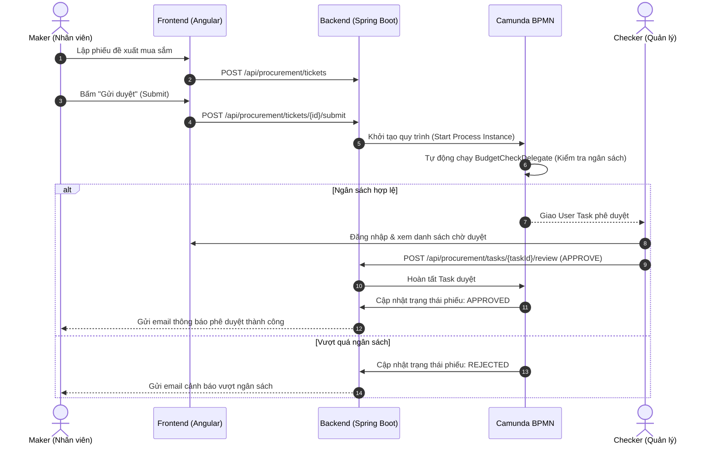

# Enterprise Procurement Management System (EPMS)

<div align="center">


[](https://openjdk.org/)
[](https://spring.io/projects/spring-boot)
[](https://angular.dev/)
[](https://www.keycloak.org/)
[](https://camunda.com/)
[](https://kafka.apache.org/)
[](https://www.postgresql.org/)
[](https://opensource.org/licenses/MIT)

<p align="center">
  <strong>Hệ thống Quản lý Mua sắm & Chuỗi Cung ứng Doanh nghiệp Chuẩn Quốc Tế</strong>
</p>

</div>

---

## 📖 1. Giới thiệu (Overview)

**Enterprise Procurement Management System (EPMS)** là giải pháp toàn diện cấp doanh nghiệp nhằm số hóa, chuẩn hóa và tự động hóa toàn bộ quy trình mua sắm, kiểm soát ngân sách và quản lý nhà cung cấp (SRM). 

Hệ thống giải quyết triệt để tình trạng vượt trần chi phí và thiếu minh bạch bằng cơ chế kiểm duyệt kép **Maker - Checker** trên nền tảng workflow **Camunda BPMN**, đồng thời bảo mật tuyệt đối với **Keycloak SSO (OAuth 2.0 PKCE)**, đăng nhập sinh trắc học **Face ID (AI)** và xử lý dữ liệu bất đồng bộ với **Apache Kafka**.

---

## 📸 2. Ảnh chụp màn hình & Giao diện (Screenshots / Demo)

| **Đăng nhập Doanh nghiệp & Face ID** | **Dashboard & Thống kê Chi phí** |
|:---:|:---:|
|  |  |
| *Xác thực Keycloak OIDC/PKCE & Face ID sinh trắc học* | *Thống kê trực quan KPI, dòng tiền & trạng thái phiếu mua sắm* |

| **Quản lý Phiếu Mua sắm (Maker - Checker)** | **Xuất Báo cáo & Tài liệu Doanh nghiệp** |
|:---:|:---:|
|  |  |
| *Luồng tạo phiếu, kiểm tra ngân sách và phê duyệt đa cấp* | *Xuất phiếu chứng từ PDF (JasperReports) & Excel (Apache POI)* |

---

## 🛠️ 3. Công nghệ sử dụng (Tech Stack)

Hệ thống được xây dựng theo kiến trúc hướng dịch vụ nhiều tầng (Layered, Event-Driven Architecture) với các công nghệ tiên tiến nhất:

| Phân hệ / Tầng | Công nghệ chính | Vai trò & Đặc điểm |
|:---|:---|:---|
| **Frontend** | Angular 22, TypeScript, SCSS, Chart.js | Giao diện Single Page Application (SPA), Reactive Forms, Guards phân quyền RBAC |
| **Backend API** | Java 21, Spring Boot 3.4.5 | RESTful API, Spring Security Resource Server, Hibernate, HikariCP, MapStruct |
| **Workflow Engine** | Camunda BPM 7.24.0 | Quản lý vòng đời quy trình mua sắm Maker - Checker, Delegates kiểm tra ngân sách |
| **IAM & Security** | Keycloak 26.0.7 | Quản lý định danh SSO, chuẩn hóa OAuth 2.0 PKCE (mô hình BFF), mã hóa JWT |
| **AI Biometrics** | Python 3.11+, FastAPI, InsightFace | Nhận diện khuôn mặt sinh trắc học phục vụ xác thực Face ID |
| **Message Broker** | Apache Kafka 4.3.1 & Kafka UI | Truyền nhận message sự kiện phi tập trung giữa các service |
| **Database** | PostgreSQL 15+ | Lưu trữ dữ liệu quan hệ ACID, hỗ trợ partitioning và schema phân tách |
| **Reporting & Export** | JasperReports 7.0 & Apache POI | Xuất chứng từ mua sắm chuẩn in ấn PDF và tổng hợp file Excel phân tích |
| **Email Service** | MailHog (SMTP Mock) | Giả lập máy chủ gửi nhận email thông báo phê duyệt/từ chối và reset mật khẩu |
| **DevOps** | Docker, Docker Compose | Đóng gói và điều phối toàn bộ hạ tầng dịch vụ chạy local nhanh chóng |

---

## 🚀 4. Hướng dẫn cài đặt (Installation)

Thực hiện lần lượt các bước sau để chạy toàn bộ hệ thống trên máy cá nhân (Local):

### Bước 1: Chuẩn bị môi trường (Prerequisites)
Đảm bảo máy tính đã cài đặt các công cụ sau:
- **Java JDK 21** & **Maven 3.9+** (hoặc dùng `./mvnw` đi kèm)
- **Node.js 20.x+** & **npm 10.x+**
- **Python 3.11+** (cho Face ID Service)
- **Docker** & **Docker Compose v2+**
- **PostgreSQL 15+** (chạy tại cổng mặc định `5432`)

### Bước 2: Clone mã nguồn
```bash
git clone https://github.com/your-organization/enterprise-procurement.git
cd enterprise-procurement
```

### Bước 3: Khởi tạo Database PostgreSQL
Truy cập vào PostgreSQL và tạo database cùng schema cho Keycloak:
```sql
CREATE DATABASE shopping_db;
\c shopping_db;
CREATE SCHEMA IF NOT EXISTS keycloak;
```

### Bước 4: Thiết lập file môi trường (.env)
Sao chép file cấu hình mẫu ở thư mục gốc:
```bash
cp .env.example .env
```
> *Tùy chỉnh lại mật khẩu cơ sở dữ liệu `KC_DB_PASSWORD` trong file `.env` nếu cần thiết.*

### Bước 5: Khởi động các hạ tầng dịch vụ (Docker)
Chạy Keycloak, Apache Kafka, Kafka UI và MailHog thông qua Docker Compose:
```bash
docker compose up -d
```
> [!NOTE]
> Trong lần chạy đầu tiên, Keycloak sẽ mất khoảng 1-2 phút để tự động khởi tạo cơ sở dữ liệu và cấu hình Realm `Shopping`.

### Bước 6: Khởi chạy Backend (Spring Boot)
1. Cấu hình file `Backend/src/main/resources/application.properties` (nếu chưa có, sao chép từ file `.example`):
   ```bash
   cp Backend/src/main/resources/application.properties.example Backend/src/main/resources/application.properties
   ```
2. Khởi chạy ứng dụng:
   ```bash
   cd Backend
   ./mvnw spring-boot:run
   # Trên Windows PowerShell:
   # .\mvnw.cmd spring-boot:run
   ```
   *Backend API sẽ chạy tại: `http://localhost:8080`*

### Bước 7: Khởi chạy Face Service (Tùy chọn cho Face ID)
```bash
cd FaceService
python -m venv .venv
# Kích hoạt venv (Windows):
.venv\Scripts\activate
# Cài đặt thư viện:
pip install -r requirements.txt
# Chạy service:
uvicorn main:app --host 0.0.0.0 --port 8000 --reload
```

### Bước 8: Khởi chạy Frontend (Angular)
```bash
cd Frontend
npm install
npm start
```
*Giao diện người dùng sẽ chạy tại: `http://localhost:4200`*

---

## 💻 5. Cách sử dụng (Usage)

### 5.1. Danh mục dịch vụ và Cổng truy cập (Access Matrix)

| Dịch vụ | Địa chỉ truy cập | Tài khoản mặc định | Mục đích |
|:---|:---|:---|:---|
| **Cổng Portal Frontend** | [http://localhost:4200](http://localhost:4200) | Đăng nhập qua Keycloak SSO | Giao diện quản lý chính cho người dùng |
| **Backend API** | [http://localhost:8080/api](http://localhost:8080/api) | Bearer JWT Token | Hệ thống API lõi |
| **Keycloak Admin Console** | [http://localhost:8081](http://localhost:8081) | `admin` / `admin` | Quản trị Realm, User, Role & Client |
| **Camunda Cockpit** | [http://localhost:8080/camunda](http://localhost:8080/camunda) | `admin` / `admin` | Giám sát luồng quy trình nghiệp vụ BPMN |
| **Kafka UI** | [http://localhost:8085](http://localhost:8085) | *(Không yêu cầu)* | Quản lý Topics, Consumers & Messages |
| **Hộp thư MailHog** | [http://localhost:8025](http://localhost:8025) | *(Không yêu cầu)* | Xem email thông báo, OTP & reset mật khẩu |

---

### 5.2. Luồng nghiệp vụ điển hình (Maker - Checker Workflow)



---

### 5.3. Mẫu gọi API (API Usage Example)

Tạo mới một phiếu đề xuất mua sắm (Yêu cầu JWT Bearer Token có role `USER` hoặc `ADMIN`):

```bash
curl -X POST "http://localhost:8080/api/procurement/tickets" \
  -H "Authorization: Bearer <YOUR_ACCESS_TOKEN>" \
  -H "Content-Type: application/json" \
  -d '{
    "ticketCode": "REQ-2026-001",
    "title": "Mua sắm thiết bị máy tính cho Phòng IT",
    "department": "IT",
    "priority": "HIGH",
    "items": [
      {
        "itemName": "Laptop Dell XPS 15",
        "category": "Hardware",
        "quantity": 3,
        "unit": "Chiếc",
        "unitPrice": 35000000,
        "totalPrice": 105000000,
        "supplierName": "FPT Trading"
      }
    ]
  }'
```

---

## 👥 6. Hướng dẫn Đóng góp (Contributing)

Chúng tôi luôn hoan nghênh sự đóng góp từ cộng đồng để phát triển hệ thống ngày một tốt hơn! Hãy tuân theo các bước sau:

1. **Fork** dự án về tài khoản GitHub của bạn.
2. Tạo một Branch tính năng mới:
   ```bash
   git checkout -b feature/tinh-nang-moi
   ```
3. Commit các thay đổi với thông điệp rõ ràng theo chuẩn [Conventional Commits](https://www.conventionalcommits.org/):
   ```bash
   git commit -m "feat(procurement): them chuc nang tinh toan thue VAT tu dong"
   ```
4. Đẩy code lên nhánh của bạn:
   ```bash
   git push origin feature/tinh-nang-moi
   ```
5. Mở một **Pull Request (PR)** trên GitHub mô tả chi tiết các thay đổi của bạn để đội ngũ kiểm duyệt xem xét.

---

## 📄 7. Giấy phép (License)

Dự án được phân phối dưới giấy phép **[MIT License](LICENSE)**. Xem thêm thông tin chi tiết tại file `LICENSE`.

<div align="center">
  <sub>Xây dựng với ❤️ bởi Đội ngũ Phát triển Doanh nghiệp. Mọi thắc mắc xin vui lòng liên hệ ban quản trị.</sub>
</div>